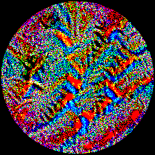
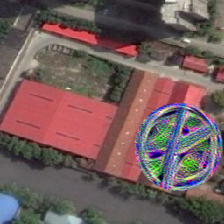
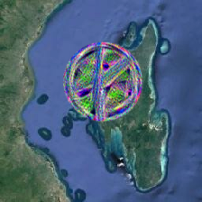
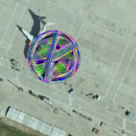
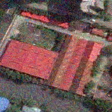
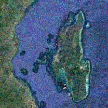
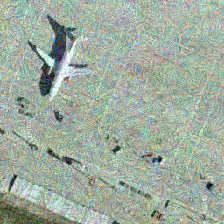

## Evasion Attacks on Resisc45
### Source: [ART by IBM](https://github.com/IBM/adversarial-robustness-toolbox) and [Armory by Twosixlabs](https://github.com/twosixlabs/armory/)

### Results and Visualizations: 
#### Adversarial Patch Attack: [Source](https://arxiv.org/abs/1712.09665)
- Patches with target Classes Beach and Overpass:  
     

- Merged patches which is 16% area of the whole image.  
     

#### Universal Perturbation Attack: [Source](https://arxiv.org/abs/1610.08401) 
- A single perturbation filter / mask is applied to all images, target class is randomized.  
     
